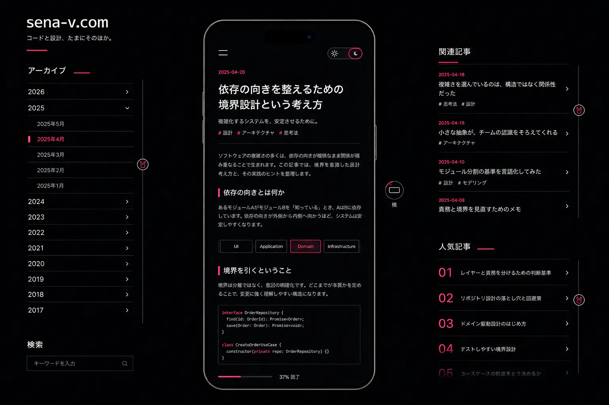
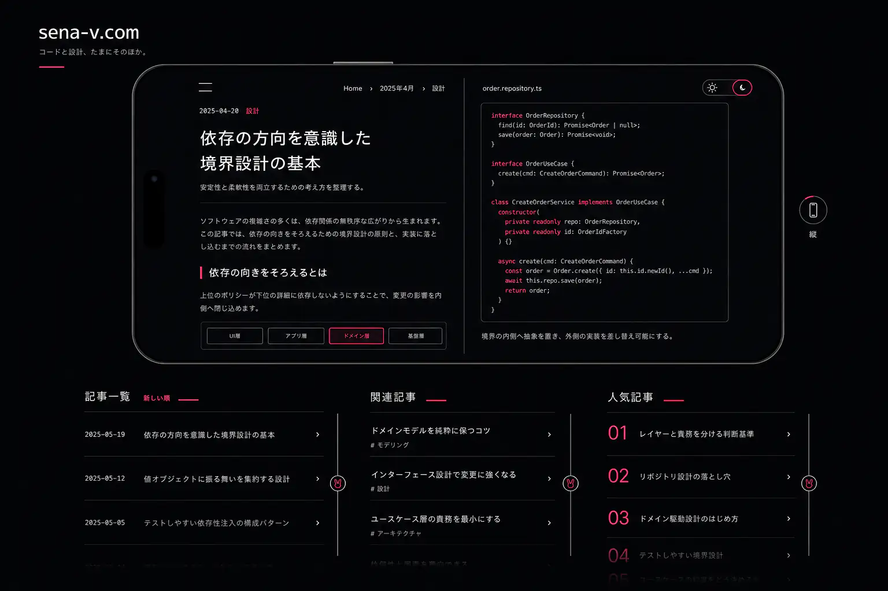

# ブログ改善 1st最終デザイン・機能仕様

確定日: 2026-08-03
状態: **1st final / 実装・検証済みの基準仕様**

この文書は、`blog.sena-v.com` の次期デザインを実装するときの判断基準である。これまでの比較資料は検討の履歴として残し、仕様が食い違う場合は本書を優先する。

## 1. 仕様の優先順位

1. 本書
2. [`final-v1/portrait.webp`](./final-v1/portrait.webp) と [`final-v1/landscape.webp`](./final-v1/landscape.webp)
3. 端末比率の数値に限り [`13-exact-shared-device-scroll-ui.md`](./13-exact-shared-device-scroll-ui.md)
4. `00`〜`15`のテキスト調査資料

最終画像は色、密度、配置、空気感を共有するためのvisual directionであり、ピクセル単位の実装指示ではない。端末比率、操作の意味、情報の優先順位、アクセシビリティ要件は本書の数値・記述を正とする。

## 2. 最終visual direction

### Portrait

### Landscape

## 3. デザインの目的

- 第一に、長く読み続けられる個人ブログであること。
- ポートフォリオ性は専用の実績カードや自己評価ではなく、記事、過去の発信、設計判断、継続的な手入れから自然に伝える。
- 大きな端末内に「いま選んでいる記事」を置き、周囲の索引から次の記事へ移動できる構造にする。
- WebGLは記事を読むための舞台装置として使い、本文の可読性や通常のWeb操作を犠牲にしない。
- 均一なカード列、過剰な英大文字ラベル、意味の薄いコピー、広いgradientやglass表現を避け、AI生成テンプレートらしさを減らす。

### 今回の非目標

- 独立した`Projects`ページをホームの主役にすること。
- PV実数を訪問者へ表示すること。
- 記事本文をWebGL textureとして描画すること。
- 最終画像の仮記事、日付、コード、順位をそのまま公開すること。
- Appleのロゴや商標を端末外装へ表示すること。

## 4. Visual system

### 色

| Token | 基準値 | 用途 |
| --- | --- | --- |
| `--canvas` | `#030406` | ページ全体の背景 |
| `--surface` | `#08090C` | 端末外の面、drawer、hover面 |
| `--text` | `#FFF8FA` | 主見出し、dark mode本文 |
| `--muted` | `#A7AAB2` | metadata、補助文 |
| `--accent` | `#FF2F68` | 短いrule、現在位置、rabbit線 |
| `--accent-active` | `#FF4F7F` | active、focus、選択状態 |
| `--accent-soft` | `#FFD0DC` | 小さなhighlight、淡い境界 |
| `--paper` | `#F7F3EF` | 端末内light mode背景 |
| `--ink` | `#17171A` | light mode本文 |

- accentは赤に寄った明るいneon roseとし、紫・lavender・orange・amberへ寄せない。
- glowは小面積のedge softnessに限定する。大きな発光面、強いbloom、全面gradientは使わない。
- 本文は白またはinkを使い、pinkを長文へ使わない。
- 実装時にWCAG 2.2 AAのcontrastを再計測する。accentを小さい文字へ使う場合も`4.5:1`を下回らない組み合わせにする。

### 書体

- ブランド名、日付、順位、操作ラベル: 幾何学的だが癖の強すぎないsans serif。
- 日本語UIと本文: 可読性の高いJapanese Gothic。
- コード: 可読性の高いmonospace。
- serifを装飾として全面採用せず、画像案より少しpopで現代的な方向へ調整する。
- font file、weight、subsetting、licenseはprototypeで比較して確定する。

### コピー

実装後の本人レビューを反映し、外側railでは次を使う。

> フロントエンドの実装メモ。

補助文は、扱う技術と記事内容を具体的に示す。

> TypeScriptやNext.js、個人開発で詰まったことを書いています。

過度に自己演出するコピーや、「思考のログをエンジニアの言葉で」のような説明的・人工的な表現は使わない。実装時に既存記事の文体と合わせて最終レビューする。

## 5. 端末外装と厳密な比率

端末はApple公開寸法を基準にしたiPhone 17 Pro相当の比率を使うが、特定製品の再現や広告表現にはしない。

- 外装の長辺 / 短辺: `150 / 71.9 = 2.08623`
- 画面の長辺 / 短辺: `2622 / 1206 = 2.17413`
- portrait基準box: `434 × 905.421875px`
- landscape表示: 同じboxを90度回転し、`1.2369924`倍へuniform scaleして`1120 × 536.84375px`
- xとyを別々に拡大しない。
- portraitとlandscapeで別meshを作らず、同じWebGL groupへ`rotation.z`とuniform `scale`だけを適用する。
- CSSのsub-pixel丸めを除き、外装比率の誤差は`0.001`以内にする。

ベゼルの厚さ、金属の反射、角丸、Dynamic Island相当の穴の大きさは、画像を正とせずprototype上で読みやすさを見ながら調整する。外装表現が本文より強くならないことを優先する。

## 6. Desktopの情報設計

### Portrait state（初期表示）

- 左: 年・月単位のarchive。新しい年・月を上に置く。
- 中央: portrait端末と現在の記事。
- 右上: 関連記事。
- 右下: 人気記事。
- archive、関連記事、人気記事は互いに独立してscrollできる。
- 端末が主役であり、周辺の索引は端末より強い面や大きな見出しを持たない。

### Landscape state

- 同じ端末を滑らかに90度回転し、uniform scaleで少し大きく表示する。
- 端末内は横幅を利用し、本文・図・コードを自然にreflowする。単にportrait画面を横へ引き伸ばさない。
- 端末の下に、端末と同じ幅を上限とした3カラムを置く。

| 左からの順 | 幅 | 内容 | 行の表現 |
| --- | ---: | --- | --- |
| 記事一覧 | `1.35fr` | 全記事の新着順 | 日付 + title |
| 関連記事 | `1fr` | 現在記事に近い記事 | title + tag |
| 人気記事 | `1fr` | 非公開PVから作る順序 | 大きめのrank + title |

- 3列を同じcard componentへ押し込めない。細いrule、余白、文字のリズムで編集的に区切る。
- 各列は独立してscrollでき、見出しはscroll領域の外へ置く。

## 7. 端末内の記事reader

- 記事、見出し、リンク、図、コードは実DOMとして描画し、選択、検索、copy、screen reader、SEOを維持する。
- 同じ`ArticleReader`をportrait、landscape、実スマートフォン表示で共有する。
- hamburger menuから記事の目次、関連記事、site navigationへ到達できる。theme切替は常時見えるreader headerへ一元化する。
- 端末画面右上にsun / moonの小型theme toggleを常設する。
- theme toggleは目安`42 × 22px`のpillとし、現在themeを色だけでなくiconと状態属性でも示す。
- 中央wordmarkは本文より小さく保ちつつ、実寸`17px`以上、操作領域`44px`以上を確保する。dotはaccent colorとする。
- wordmarkまたはheaderの空白面を押すと記事先頭へ戻る。desktopでは端末内reader、実スマートフォンではdocumentをscrollし、menu・theme操作では発火させない。
- scroll-to-topは通常smooth、`prefers-reduced-motion`では即時移動とする。
- 選択themeはlocal storageとOS設定を使って保持し、回転時も失わない。
- article slug、目次位置、theme、focus可能な見出しは回転中も維持する。

## 8. 縦横切替

### 操作の意味

iconは現在の向きではなく、押した後に到達する向きを示す。

- portrait state: 横長phone icon + `横`、`aria-label="横表示へ切り替える"`
- landscape state: 縦長phone icon + `縦`、`aria-label="縦表示へ切り替える"`

### 外観と位置

- hit target: `44 × 44px`
- visible ring: `32px`
- icon: `18px`
- 常時表示label: `9px`
- 端末外の右側、中央より少し下へ1個だけ置く。
- 大きな説明card、二重のorientation selector、中央下の大きなsegmented controlは使わない。
- tooltipはhover / focusでのみ表示する。

### motion

目安のtotal durationは`680ms`。実装時は実機で速さとeasingを微調整する。

1. `0–180ms`: 周辺索引と端末内レイアウトを弱くfadeする。
2. `40–560ms`: 同じ端末meshを回転し、landscape時は規定値までuniform scaleする。
3. 回転が約45度を越えた時点: 端末内DOMのlayout stateを切り替える。
4. `420–680ms`: 新しい記事layoutと周辺索引を表示する。

- animation中の連打を防ぐが、状態をlostしない。
- `prefers-reduced-motion: reduce`では3D回転を省き、約`150ms`のcrossfadeへ置き換える。

## 9. Scroll UIとrabbit symbol

### Scrollできることの伝え方

各索引で次を併用する。

1. 2件以上を完全表示し、次の行を`30–40%`だけ見せる。
2. 下端約`22px`へ薄いCSS maskを置く。
3. 右端に`2px` railを常時表示する。
4. focus中の領域だけrailとfocus outlineを強くする。

native scrollの挙動を維持し、wheel、trackpad、touch drag、scrollbar drag、矢印/Page Up/Page Downキーを受ける。

### Rabbit scroll thumb

- 全体: `30px`。操作hit areaは`44px`以上を維持する。
- 外円: `#FFF8FA`、`2px` stroke
- 内側: `#FF4F7F`の右向きrabbit outline。独立した丸いtailを置かず、鼻先、前後差のある2本の耳、背中、胸、後脚、背中につながる小さな尾を連続した輪郭で示す。
- 内部は中抜きとし、strokeは実寸で潰れない`1.4px`以上を目安とする。目、鼻の点、口、頬などの顔パーツは描かない。
- 可愛いcharacterや動物の顔へ寄せず、右を向いて座る影絵に近い記号として扱う。
- rabbitはscroll thumbにだけ使い、回転icon、theme toggle、装飾logoへ流用しない。
- decorative SVGは`aria-hidden="true"`とし、scroll領域そのものへ意味のあるlabelを付ける。
- thumbは小さくてもrail上の現在位置を判別でき、whiteの外円がdark backgroundで埋もれないこと。

## 10. 記事リストのデータ仕様

### 記事一覧 / Archive

- 公開日の降順を標準とする。
- 外部記事は元の公開日、掲載先、外部URLを持つlink articleとして同じ時間軸へ統合する。
- 過去記事の日付を新しく見せる目的では変更しない。

### Writingsの検索とtag絞り込み

- 検索語、複数tag、archiveをGET parameterで保持し、reload・共有・戻る操作で条件を失わない。
- tag選択は本文行を押し下げず、背景から分離したpopoverへ表示する。
- 複数tagはAND条件とし、選択中のtagを個別解除・一括解除できる。個別解除時は検索語、archive、ほかのtagを維持する。
- tagは角丸cardの反復ではなく、記事本文と同じ`#tag`表現を使う。
- 1280px幅の初見で見出し、検索、絞り込み、先頭記事まで到達できる密度にする。

### About

- 大きな自己紹介cardや実績の自己採点を置かず、「書いていること」「日付を変えずに残す」「迷った過程も書く」を短い本文で説明する。
- 2019 / 2020 / 2026の履歴を細いruleで示し、GitHub・Qiita・X・Writingsへの外部導線を本文より弱い階層で置く。
- 1280px幅の初見で主見出し、履歴、最初の説明まで見せ、巨大文字と長いscrollを避ける。

### 関連記事

1. 記事frontmatterなどの手動指定を優先する。
2. 指定がなければ共有tag / categoryから算出する。
3. 現在の記事は除外する。
4. 同点は公開日の新しい順で安定させる。

### 人気記事

- GA4 Data APIから直近30日のローカル記事pathを集計する。
- PV実数はHTML、Client Component、公開API、構造化データへ出さず、server側でslugと順序だけに変換する。
- 認証情報はserver環境変数だけに置く。
- 外部APIはrequestごとに呼ばず、`6–24時間`cacheする。
- データ不足、認証失敗、API障害時は編集者指定または新着順へfallbackし、画面を壊さない。
- 数字を公開しないため、UI上は順位とtitleだけを使う。初期のデータ量が少ない間は「人気記事」を隠すか、「よく読んでほしい記事」として編集者指定を使う。
- 外部記事のclickはPVと混ぜず、別eventとして扱う。

## 11. GA4計測

- 記事のcanonical path単位で`page_view`を重複なく送る。
- localhostとPreview Deploymentは本番計測から除外する。
- 縦横切替、theme切替、各索引からの記事遷移は、改善検証に必要な場合だけevent化する。
- event候補: `orientation_change`、`theme_change`、`article_list_click`。
- 検索文字列、記事本文、個人情報をevent parameterへ送らない。
- GA4が停止しても記事閲覧、新着順、関連fallbackは動く。

## 12. WebGL / DOM構成

- React Three Fiberは端末外装、light、camera、回転motionに限定する。
- 端末画面はDOMを重ね、文章をWebGL canvasへ焼き込まない。
- 本文はWebGLと分離したscreen座標のDOM overlayを使い、文字のぼやけとcanvas依存を避ける。
- animationしていない間は`frameloop="demand"`とし、interaction時だけinvalidateする。
- WebGL非対応、low-power、初期化失敗時は同じ`ArticleReader`を2D frame内へ表示する。
- WebGLの読み込み前にも記事URLと主要本文へ到達できる構造にする。

## 13. Responsive / 実スマートフォン

- desktopの十分なviewportでのみWebGL shellと周辺索引を表示する。初期breakpoint候補は`1200px`で、prototype計測後に確定する。
- 小さいtablet / smartphoneではWebGL端末を入れ子にせず、`ArticleReader`を通常のresponsive DOMとして直接表示する。
- 実スマートフォンではCSSのorientationとviewportを使い、portrait / landscapeで本文を自然にreflowする。
- hamburger drawerから目次、関連記事、site navigationへ到達でき、theme切替は常時見えるreader headerから操作できる。
- desktop用の外周archive、3カラム、orientation controlはmobileで無理に縮小しない。

## 14. Accessibility

- 本文、link、button、focus状態はWCAG 2.2 AAを基準にする。
- 色だけでselected / active / rankingの意味を伝えない。
- すべての操作をkeyboardで実行できる。
- drawerはfocus trap、Escapeで閉じる、close後のfocus復帰を持つ。
- scroll領域には見出しまたは`aria-label`を関連付ける。
- orientation controlとtheme toggleは現在状態と到達先を読み上げられる。
- `prefers-reduced-motion`とOS themeを尊重する。
- 記事本文はcanvasの代替説明ではなく、最初からsemantic DOMとして存在する。

## 15. Performance

- mobileではWebGL bundleを読み込まない構成を優先する。
- desktopでもcanvasをlazy-loadし、記事本文とnavigationの初期表示を止めない。
- idle中の連続60fps renderingを行わない。
- 端末素材と比較画像は適切に圧縮し、実ページの記事画像はresponsive sourceを使う。
- fontは必要weightだけをself-hostまたは適切にsubsetする。
- route changeごとのGA4送信と人気順取得が重複しないようにする。
- implementation前後でLighthouse、Core Web Vitals、JS / image / font量を記録する。

## 16. URL / SEO

- 記事は固有のcanonical URLを持ち、WebGL stateやquery parameterがない状態でも直接開ける。
- title、description、published / updated date、OG情報、構造化データは通常のserver-rendered metadataとして出す。
- orientationやthemeをcanonical URLへ含めない。
- JavaScriptやWebGLが失敗しても、本文と主要navigationをindex・閲覧できる。

## 17. 受け入れ条件

- [x] portrait / landscapeが同一端末meshで、外装比率誤差`0.001`以内。
- [x] landscapeはuniform scaleだけで大きくなり、縦横別の歪みがない。
- [x] portrait初期表示、landscapeへの回転、portraitへの復帰ができる。
- [x] 回転buttonが右側に1個だけあり、iconは到達先の向きを示す。
- [x] theme toggleが縦横両方の端末画面右上にあり、状態を維持する。
- [x] portrait右側が関連記事 / 人気記事の上下、landscape下部が記事一覧 / 関連記事 / 人気記事の3列。
- [x] すべての索引が実際にscrollでき、次行、mask、rail、rabbit thumbでそれが伝わる。
- [x] rabbit thumbが小径・白い太めの外円・中抜きの赤pink右向きoutlineで、可愛いcharacter表現へ寄りすぎない。
- [x] reader wordmarkとheader空白面から、desktop / smartphoneそれぞれの読書領域を先頭へ戻せる。
- [x] Writingsで複数tagをAND選択し、個別解除・一括解除できる。
- [x] accentが赤pink neonに見え、purple / orangeへ色転びしていない。
- [x] hamburger、目次、dark mode、keyboard、reduced motionが動く。
- [x] 実スマートフォンでは端末外装を表示せず、同じ記事readerを直接使える。
- [x] PV実数とGA認証情報がclientへ露出しない。
- [x] WebGL / GA4障害時にも記事閲覧と新着順が動く。
- [x] Playwrightの主要viewport screenshot、keyboard操作、reduced motion、theme維持、fallbackのtestが通る。

## 18. 実装順

1. Design token、font候補、semanticな`ArticleReader`を作る。
2. Portrait / landscapeのdesktop情報設計と3種類の索引を実DOMで作る。
3. Scroll affordanceとrabbit SVGを作り、keyboard / touchを検証する。
4. Theme、hamburger、目次drawer、mobile直表示を実装する。
5. 同一比率のWebGL shellと縦横rotationを統合する。
6. GA4 Data APIによる非公開人気順とfallbackを追加する。
7. Accessibility、performance、visual regressionを検証し、文言のAI脱臭を行う。

各段階を小さくcommitできる単位へ分ける。WebGLを最後寄りに置くことで、外装がなくても読めるブログを先に完成させる。

## 19. Prototypeで決定した項目

- 書体はsystem Japanese GothicとAvenir Next系、monoを用途別に使う。
- rabbitは30pxの右向き・顔パーツなし・中抜きの座り姿outlineとする。
- ベゼルは短辺3.2%、同心角丸、graphite反射と弱いrose highlightを使う。
- 回転は通常680ms、reduced motionでは約150msのcrossfadeとする。
- WebGLは1200px以上かつsave-data無効・device memory 2GB超で、hover/focus/回転時だけ遅延起動する。
- 本文はscreen座標のDOM overlayとする。
- 外側コピーは「フロントエンドの実装メモ。」に確定する。

各決定は1619×886、1280×720、390×844の実表示と操作で検証した。

## 20. 現在branchの範囲

`feature/blog-reboot-2026`ではproduction UI、遅延WebGL外装、GA4人気順とfallback、responsive reader、アクセシビリティ、security headerまで実装・検証する。リライト前の`blog-reboot-2026`記事だけは`draft`として公開面から除外する。

寸法参照:

- [Apple — iPhone 17 Pro Technical Specifications](https://www.apple.com/iphone-17-pro/specs/)
- [Apple Developer — iPhone 17 Pro Dimensional Drawing](https://developer.apple.com/download/files/accessories/dimensional-drawings/iphone-17-pro.pdf)
